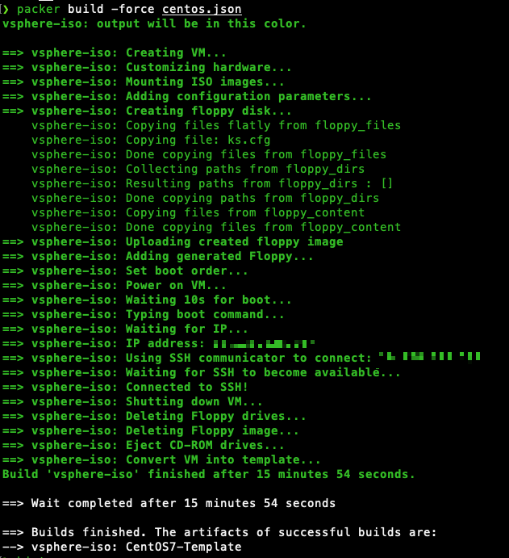

# NetApp Cloud Manager automated deployment on VMware with Packer & Terraform

## pre-reqs

* Terraform https://www.terraform.io/downloads
* Packer https://www.packer.io/downloads
* CentOS 7 ISO https://www.centos.org/download/
* NetApp Cloud Manager install package https://mysupport.netapp.com/site/products/all/details/cloud-manager/downloads-tab

This installation is tested and validated with;

* Terraform v1.1.9
* Packer 1.8.0
* CentOS-7-x86_64-DVD-2009.iso
* OnCommandCloudManager-V3.9.17

# About the automation

This automation builds a VM template on CentOS 7, deploys that template and installs **NetApp Cloud Manager** - all automated.

Packer requires a DHCP enabled network to build the VM template

# Run the automation

## Create environment variables

Rename the `.env_example` to `.env` and adjust the content to your environment. You need to add credentials and connection properties to your vCenter server.

**Important**, the automation uses the default password of `server` and you !need! to change that after deployment to secure your environment.
**Important**, Cloud Manager requires 4 vCPU, 16GB RAM & 100+GB storage(I recommend 250GB)

## Deploy!

1. Make sure you have all the pre-reqs
2. Upload **CentOS-7-x86_64-DVD-2009.iso** to a VMware datastore and adjust the `TF_VAR_iso_url` variable in your `.env` file
3. Place the **OnCommandCloudManager-V3.9.17.sh** file in the `tf_deploy` folder
4. Load your environment variables with `export $(xargs < .env)`
5. Build the VM template with `packer build centos.json` - (takes about ~15-20 min)

6. Move to the tf_deploy folder and run `terraform apply` to deploy Cloud Manager VM from the template
7. After deployment, browse to http://{cloudmanager_ip} to finish the installation

Read more about Cloud Manager deployment on https://docs.netapp.com/us-en/cloud-manager-setup-admin/task-installing-linux.html

**Important**, the automation uses the default password of `server` and you !need! to change that after deployment to secure your environment.